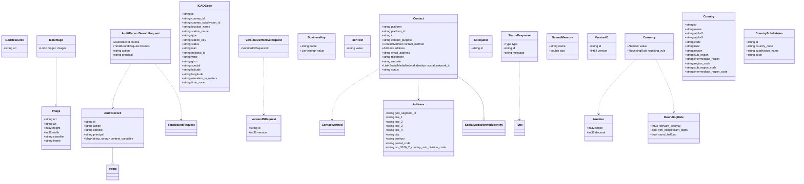

# google.retail.common.pb

## Comments

```mermaid
classDiagram

  class I18nResource{
    +string url
  }

  class Image{
    +string url
    +string alt
    +int32 height
    +int32 width
    +string classifier
    +string frame
  }

  class Address{
    +string geo_segment_id
    +string line_1
    +string line_2
    +string line_3
    +string line_4
    +string city
    +string territory
    +string postal_code
    +string iso_3166_2_country_sub_division_code
  }

  class TimeBoundRequest{
  }
  AuditRecordSearchRequest ..> AuditRecord
  AuditRecordSearchRequest ..> TimeBoundRequest
  class AuditRecordSearchRequest{
    +AuditRecord criteria
    +TimeBoundRequest bounds
    +string action
    +string principal
  }
  I18nImage --o Image
  class I18nImage{
    +List~Image~ images
  }

  class ICAOCode{
    +string id
    +string country_id
    +string country_subdivision_id
    +string location_name
    +string station_name
    +string type
    +string station_key
    +string status
    +string icao
    +string national_id
    +string wmo
    +string ghcn
    +string special
    +string latitude
    +string longitude
    +string elevation_in_meters
    +string time_zone
  }
  VersionIDEffectiveRequest ..> VersionIDRequest
  class VersionIDEffectiveRequest{
    +VersionIDRequest id
  }
  AuditRecord --o  string
  class AuditRecord{
    +string id
    +string action
    +string context
    +string principal
    +Map~string, string~ context_variables
  }

  class BusinessKey{
    +string name
    +List~string~ value
  }

  class I18nText{
    +string value
  }
  Contact ..> ContactMethod
  Contact ..> Address
  Contact --o SocialMediaNetworkIdentity
  class Contact{
    +string platform
    +string platform_id
    +string id
    +string contact_purpose
    +ContactMethod contact_method
    +Address address
    +string email_address
    +string telephone
    +string website
    +List~SocialMediaNetworkIdentity~ social_network_id
    +string status
  }

  class IDRequest{
    +string id
  }

  class VersionIDRequest{
    +string id
    +int32 version
  }
  StatusResponse ..> Type
  class StatusResponse{
    +Type type
    +string id
    +string message
  }

  class NamedMeasure{
    +string name
    +double size
  }

  class VersionID{
    +string id
    +int64 version
  }

  class Number{
    +int32 whole
    +int32 decimal
  }

  class RoundingRule{
    +int32 relevant_decimal
    +bool trim_insignificant_digits
    +bool round_half_up
  }
  Currency ..> Number
  Currency ..> RoundingRule
  class Currency{
    +Number value
    +RoundingRule rounding_rule
  }

  class Country{
    +string id
    +string name
    +string alpha2
    +string alpha3
    +string code
    +string iso2
    +string region
    +string sub_region
    +string intermediate_region
    +string region_code
    +string sub_region_code
    +string intermediate_region_code
  }

  class CountrySubdivision{
    +string id
    +string country_code
    +string subdivision_name
    +string code
  }

```

