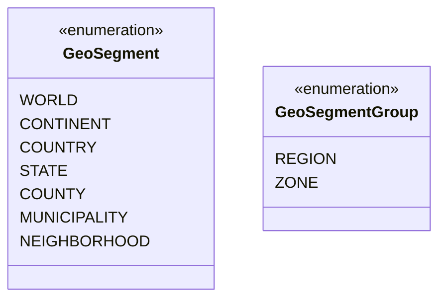

# google.retail.enums.geo

## Comments

```mermaid
classDiagram
class GeoSegment{
<<enumeration>>
  WORLD
  CONTINENT
  COUNTRY
  STATE
  COUNTY
  MUNICIPALITY
  NEIGHBORHOOD
}
class GeoSegmentGroup{
<<enumeration>>
  REGION
  ZONE
}

```

