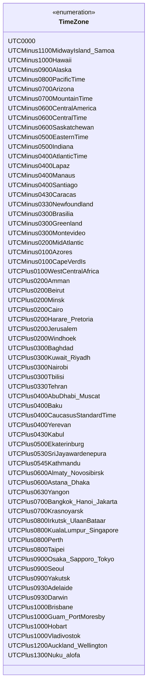

# google.retail.enums.time

## Comments

```mermaid
classDiagram
class TimeZone{
<<enumeration>>
  UTC0000
  UTCMinus1100MidwayIsland_Samoa
  UTCMinus1000Hawaii
  UTCMinus0900Alaska
  UTCMinus0800PacificTime
  UTCMinus0700Arizona
  UTCMinus0700MountainTime
  UTCMinus0600CentralAmerica
  UTCMinus0600CentralTime
  UTCMinus0600Saskatchewan
  UTCMinus0500EasternTime
  UTCMinus0500Indiana
  UTCMinus0400AtlanticTime
  UTCMinus0400Lapaz
  UTCMinus0400Manaus
  UTCMinus0400Santiago
  UTCMinus0430Caracas
  UTCMinus0330Newfoundland
  UTCMinus0300Brasilia
  UTCMinus0300Greenland
  UTCMinus0300Montevideo
  UTCMinus0200MidAtlantic
  UTCMinus0100Azores
  UTCMinus0100CapeVerdIs
  UTCPlus0100WestCentralAfrica
  UTCPlus0200Amman
  UTCPlus0200Beirut
  UTCPlus0200Minsk
  UTCPlus0200Cairo
  UTCPlus0200Harare_Pretoria
  UTCPlus0200Jerusalem
  UTCPlus0200Windhoek
  UTCPlus0300Baghdad
  UTCPlus0300Kuwait_Riyadh
  UTCPlus0300Nairobi
  UTCPlus0300Tbilisi
  UTCPlus0330Tehran
  UTCPlus0400AbuDhabi_Muscat
  UTCPlus0400Baku
  UTCPlus0400CaucasusStandardTime
  UTCPlus0400Yerevan
  UTCPlus0430Kabul
  UTCPlus0500Ekaterinburg
  UTCPlus0530SriJayawardenepura
  UTCPlus0545Kathmandu
  UTCPlus0600Almaty_Novosibirsk
  UTCPlus0600Astana_Dhaka
  UTCPlus0630Yangon
  UTCPlus0700Bangkok_Hanoi_Jakarta
  UTCPlus0700Krasnoyarsk
  UTCPlus0800Irkutsk_UlaanBataar
  UTCPlus0800KualaLumpur_Singapore
  UTCPlus0800Perth
  UTCPlus0800Taipei
  UTCPlus0900Osaka_Sapporo_Tokyo
  UTCPlus0900Seoul
  UTCPlus0900Yakutsk
  UTCPlus0930Adelaide
  UTCPlus0930Darwin
  UTCPlus1000Brisbane
  UTCPlus1000Guam_PortMoresby
  UTCPlus1000Hobart
  UTCPlus1000Vladivostok
  UTCPlus1200Auckland_Wellington
  UTCPlus1300Nuku_alofa
}

```

