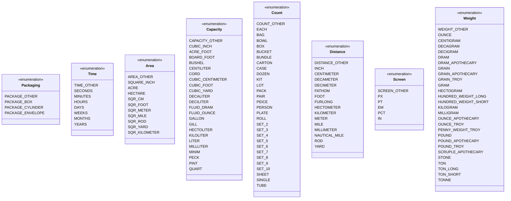

# google.retail.enums.uom

## Comments

```mermaid
classDiagram
class Packaging{
<<enumeration>>
  PACKAGE_OTHER
  PACKAGE_BOX
  PACKAGE_CYLINDER
  PACKAGE_ENVELOPE
}
class Time{
<<enumeration>>
  TIME_OTHER
  SECONDS
  MINUTES
  HOURS
  DAYS
  WEEKS
  MONTHS
  YEARS
}
class Area{
<<enumeration>>
  AREA_OTHER
  SQUARE_INCH
  ACRE
  HECTARE
  SQR_CM
  SQR_FOOT
  SQR_METER
  SQR_MILE
  SQR_ROD
  SQR_YARD
  SQR_KILOMETER
}
class Capacity{
<<enumeration>>
  CAPACITY_OTHER
  CUBIC_INCH
  ACRE_FOOT
  BOARD_FOOT
  BUSHEL
  CENTILITER
  CORD
  CUBIC_CENTIMETER
  CUBIC_FOOT
  CUBIC_YARD
  DECALITER
  DECILITER
  FLUID_DRAM
  FLUID_OUNCE
  GALLON
  GILL
  HECTOLITER
  KILOLITER
  LITER
  MILLLITER
  MINIM
  PECK
  PINT
  QUART
}
class Count{
<<enumeration>>
  COUNT_OTHER
  EACH
  BAG
  BOWL
  BOX
  BUCKET
  BUNDLE
  CARTON
  CASE
  DOZEN
  KIT
  LOT
  PACK
  PAIR
  PEICE
  PERSON
  PLATE
  ROLL
  SET_2
  SET_3
  SET_4
  SET_5
  SET_6
  SET_7
  SET_8
  SET_9
  SET_10
  SHEET
  SINGLE
  TUBE
}
class Distance{
<<enumeration>>
  DISTANCE_OTHER
  INCH
  CENTIMETER
  DECAMETER
  DECIMETER
  FATHOM
  FOOT
  FURLONG
  HECTOMETER
  KILOMETER
  METER
  MILE
  MILLIMETER
  NAUTICAL_MILE
  ROD
  YARD
}
class Screen{
<<enumeration>>
  SCREEN_OTHER
  PX
  PT
  EM
  PCT
  IN
}
class Weight{
<<enumeration>>
  WEIGHT_OTHER
  OUNCE
  CENTIGRAM
  DECAGRAM
  DECIGRAM
  DRAM
  DRAM_APOTHECARY
  GRAIN
  GRAIN_APOTHECARY
  GRAIN_TROY
  GRAM
  HECTOGRAM
  HUNDRED_WEIGHT_LONG
  HUNDRED_WEIGHT_SHORT
  KILOGRAM
  MILLIGRAM
  OUNCE_APOTHECARY
  OUNCE_TROY
  PENNY_WEIGHT_TROY
  POUND
  POUND_APOTHECARY
  POUND_TROY
  SCRUPLE_APOTHECARY
  STONE
  TON
  TON_LONG
  TON_SHORT
  TONNE
}

```

