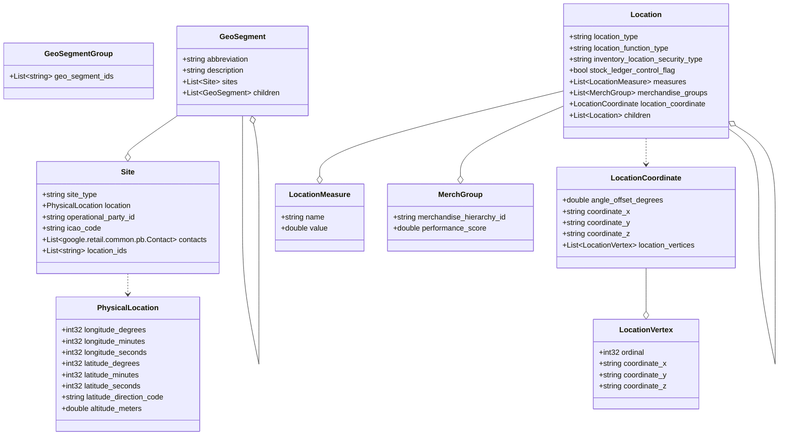

# google.retail.location.pb

## Comments

```mermaid
classDiagram
  LocationCoordinate --o LocationVertex
  class LocationCoordinate{
    +double angle_offset_degrees
    +string coordinate_x
    +string coordinate_y
    +string coordinate_z
    +List~LocationVertex~ location_vertices
  }

  class GeoSegmentGroup{
    +List~string~ geo_segment_ids
  }

  class PhysicalLocation{
    +int32 longitude_degrees
    +int32 longitude_minutes
    +int32 longitude_seconds
    +int32 latitude_degrees
    +int32 latitude_minutes
    +int32 latitude_seconds
    +string latitude_direction_code
    +double altitude_meters
  }
  Site ..> PhysicalLocation
  class Site{
    +string site_type
    +PhysicalLocation location
    +string operational_party_id
    +string icao_code
    +List~google.retail.common.pb.Contact~ contacts
    +List~string~ location_ids
  }

  class LocationMeasure{
    +string name
    +double value
  }
  GeoSegment --o Site
  GeoSegment --o GeoSegment
  class GeoSegment{
    +string abbreviation
    +string description
    +List~Site~ sites
    +List~GeoSegment~ children
  }

  class LocationVertex{
    +int32 ordinal
    +string coordinate_x
    +string coordinate_y
    +string coordinate_z
  }

  class MerchGroup{
    +string merchandise_hierarchy_id
    +double performance_score
  }
  Location --o LocationMeasure
  Location --o MerchGroup
  Location ..> LocationCoordinate
  Location --o Location
  class Location{
    +string location_type
    +string location_function_type
    +string inventory_location_security_type
    +bool stock_ledger_control_flag
    +List~LocationMeasure~ measures
    +List~MerchGroup~ merchandise_groups
    +LocationCoordinate location_coordinate
    +List~Location~ children
  }

```

