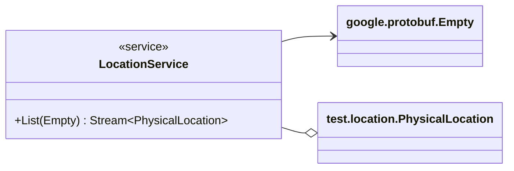

# Package: test.service

Copyright 2022 Google LLC Licensed under the Apache License, Version 2.0 (the "License"); you may not use this file except in compliance with the License. You may obtain a copy of the License at http://www.apache.org/licenses/LICENSE-2.0 Unless required by applicable law or agreed to in writing, software distributed under the License is distributed on an "AS IS" BASIS, WITHOUT WARRANTIES OR CONDITIONS OF ANY KIND, either express or implied. See the License for the specific language governing permissions and limitations under the License.

## Imports

| Import                       | Description |
|------------------------------|-------------|
| test/location/model.proto    |             |
| google/protobuf/empty.proto  |             |
| google/api/annotations.proto |             |

## Options

| Name                | Value                                         | Description     |
|---------------------|-----------------------------------------------|-----------------|
| go_package          | "github.com/rrmcguinness/proto/test/location" | Go Lang Options |
| java_package        | "com.github.rrmcguinness.proto.test.location" | Java Options    |
| java_multiple_files | true                                          |                 |

## Service: LocationService

FQN: test.service

The LocationService is responsible for CRUD operations of Physical Locations.

| Method | Parameter (In) | Parameter (Out)            | Description                               |
|--------|----------------|----------------------------|-------------------------------------------|
| List   | Empty          | Stream\<PhysicalLocation\> | List returns a list of physical locations |

### LocationService Diagram

<!-- Created by: Proto Diagram Tool -->
<!-- https://github.com/rrmcguinness/proto-diagram-tool -->

